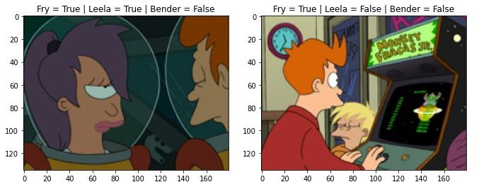

# Kaggle Futurama Character Detection

Notebook used in the below Kaggle competition.  
https://www.kaggle.com/competitions/comp-mediavida-2-futurama

Multi-label classification problem, the goal is to detect in the test frames whether any of the three target characters show up.

The solution uses transfer learning on a ResNet with ImageNet weights, and fine-tuning of the network.

